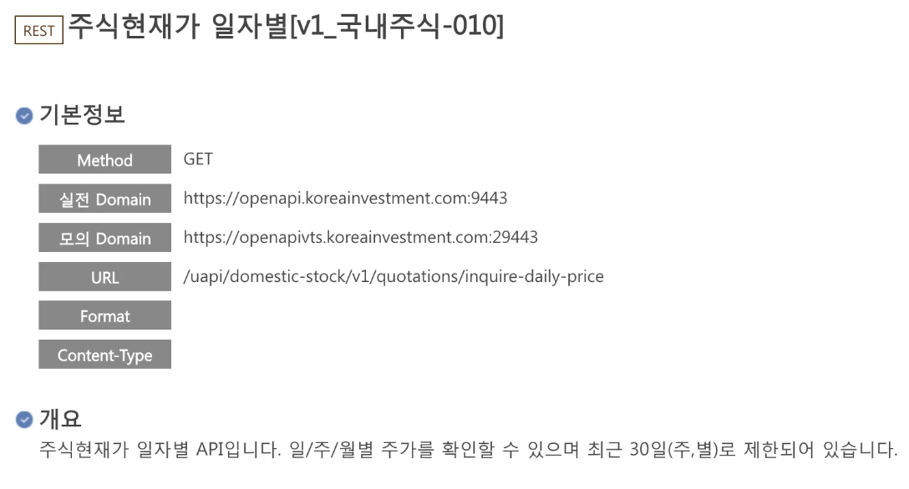

# 📈 D3.js 기반 한국 주식 실시간 차트

한국투자증권 API와 D3.js를 이용해 만든 실시간 주식 차트 프로젝트입니다.  
실제 증권사에서 사용하는 차트처럼 **캔들 차트 + 거래량 + 이동평균선** 등을 시각화하며,  
**실전 투자 계좌 연동** 기반으로, **일/주/월/년 단위**로 주가를 확인할 수 있습니다.

---

## ✅ 프로젝트 목표

- 실전 투자 계좌 기반, 한국투자증권 API 연동
- 일/주/월/년 단위 구분
- 일봉 3개월치 → 기준으로 나머지 기간 데이터 계산
- 주식 차트 + 거래량 차트 분리 렌더링
- 마우스 스크롤로 차트 확대/축소
- 마우스 호버 시 툴팁(Tooltip) 정보 제공
- 민감 정보는 `.env` 파일로 분리
- 백엔드/프론트엔드 디렉토리 구조 분리

---

## 🛠️ 사용 기술

| 분류       | 기술 스택                                      |
| ---------- | ---------------------------------------------- |
| 프론트엔드 | React, TypeScript, D3.js                       |
| 백엔드     | FastAPI, Python 3.11, requests, dotenv         |
| 차트 기능  | D3.js 기반 캔들차트 + 거래량 + 이동평균선 구현 |
| API        | 한국투자증권 Open API (실전투자계좌)           |

---

## 📦 폴더 구조

```
stockChartApp/
├── backend/
│   ├── main.py
│   ├── kis_api.py
│   ├── token_manager.py
│   └── ...
├── frontend/
│   ├── src/
│   │   ├── components/
│   │   │   ├── D3CandlestickChart.tsx
│   │   │   └── ChartWrapper.tsx
│   │   └── App.tsx
│   └── ...
├── .env
├── requirements.txt
└── README.md
```

---

## 🔐 환경변수 (.env)

```env
APP_KEY=발급받은_API_KEY
APP_SECRET=발급받은_SECRET
BASE_URL=https://openapi.koreainvestment.com:9443
```

---

## 📘 사용한 API 문서

- API 이름: **주식현재가 일자별 [v1_국내주식-010]**
- API 주소:
  ```
  https://openapi.koreainvestment.com:9443/uapi/domestic-stock/v1/quotations/inquire-daily-price
  ```
- 데이터 형식: JSON / GET 방식
- 주요 제한사항:  
  **최근 30일(주,월별 기준)** 까지만 조회 가능
- 사용 가이드 문서:  
  [한국투자증권 Open API 공식 Postman 문서](https://github.com/koreainvestment/open-trading-api/blob/main/postman/README.md)  
  👉 Postman을 활용하여 API 요청을 테스트하고 구조를 확인한 후 개발에 활용했습니다.

---

## 🧪 실행 방법

### 백엔드 실행 (FastAPI)

```bash
python -m venv venv
source venv/bin/activate  # 윈도우: venv\Scripts\activate
pip install -r ../requirements.txt
uvicorn backend.main:app --reload
```

### 프론트엔드 실행 (React)

```bash
cd frontend
npm install
npm run dev
```

➡ 접속: [http://localhost:5173](http://localhost:5173)

---

## 📸 API 응답 범위 시각화

> 한국투자증권 일자별 API는 최근 30일(주,월 단위 기준)만 지원됩니다.
> 

---
